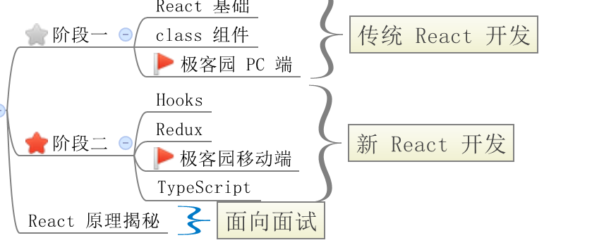
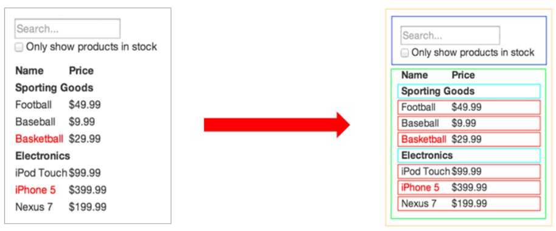
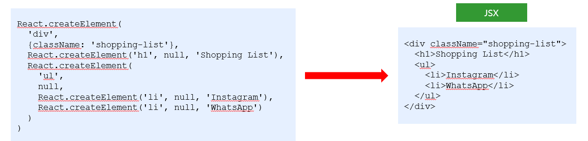
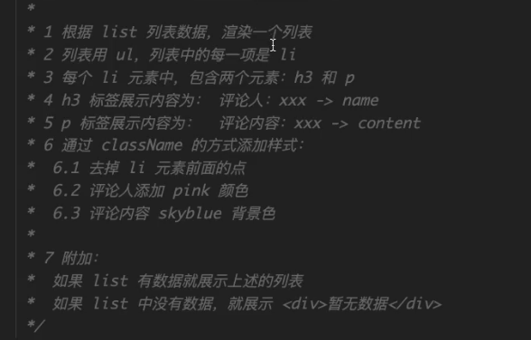

# 课程安排



# React 概述

## 学习目标

- 能够说出 react 是什么
- 能够说出 react 的特点
- 能够掌握 react 的基本用法
- 能够使用 react 脚手架

## React 介绍


> react 是一个用于构建用户**界面**的 JavaScript 库
>
> react 官网(<https://reactjs.org/>)
>
> react 中文网(<https://zh-hans.reactjs.org/>)

- React 是一个用于构建用户界面（UI，对咱们前端来说，简单理解为：HTML 页面）的 JavaScript 库
- 如果从 mvc 的角度来看，React 仅仅是视图层（V）的解决方案。也就是只负责视图的渲染，并非提供了完整了 M 和 C 的功能
- react/react-dom/react-router/redux: 框架
- React 起源于 Facebook 内部项目（News Feed，2011），后又用来架设 Instagram 的网站（2012），并于 2013 年 5 月开源[react 介绍](https://baike.baidu.com/item/react/18077599?fr=aladdin)

- React 是最流行的前端开发框架之一，其他：Vue、Angular 等等[框架对比](https://www.npmtrends.com/)

## react 特点

### 声明式 UI

你只需要描述 UI（HTML）看起来是什么样的，就跟写 HTML 一样

```jsx
const aa = (
  <div className="app">
    <h1>Hello React! 动态数据变化:{count}</h1>
  </div>
);
```

声明式对应的是命令式，声明式关注的是 what，命令式关注的是 how

### 组件化

- 组件是 react 中**最重要**的内容
- 组件用于表示页面中的部分内容
- 组合、复用多个组件，就可以实现完整的页面功能



### 学习一次，随处使用

- 使用 react/rect-dom 可以开发 Web 应用
- 使用 react/react-native 可以开发移动端原生应用（react-native） RN 安卓 和 ios 应用 flutter
- 使用 react 可以开发 VR（虚拟现实）应用（react360）


从你的角度看 React 特点：

- 工资高、大厂必备（阿里在用）
- 工资高、大厂必备（字节跳动在用）
- 工资高、大厂必备（百度、腾讯、京东、蚂蚁金服、拼多多、美团、外企、银行等都在用）

## React 脚手架（CLI）

- React 脚手架的介绍
- 使用 React 脚手架创建项目
- 项目目录结构调整
- npm i -g @vue/cli => npm i -g create-react-app
- vue create xxx => create-react-app xxx

### React 脚手架的介绍

- 脚手架：为了保证各施工过程顺利进行而搭设的工作平台
- 对于前端项目开发来说，脚手架是为了保证前端项目开发过程顺利进行而搭设的开发平台
- 脚手架的意义：
  - 现代的前端开发日趋成熟，需要依赖于各种工具，比如，webpack、babel、eslint、sass/less/postcss 等
  - 工具配置繁琐、重复，各项目之间的配置大同小异
  - 开发阶段、项目发布，配置不同
    - 项目开始前，帮你搭好架子，省去繁琐的 webpack 配置
    - 项目开发时，热更新、格式化代码、git 提交时自动校验代码格式等
    - 项目发布时，一键自动打包，包括：代码压缩、优化、按需加载等

### 使用 React 脚手架创建项目

- 命令：`npx create-react-app react-basic`
  - `npx create-react-app` 是固定命令，表示先通过 npm 下载 create-react-app 脚手架模块包
  - `create-react-app` 是 React 脚手架的名称
  - `react-basic` 表示项目名称，可以修改
- `npx` 是 npm v5.2 版本新添加的命令，用来简化 npm 中工具包的使用

  - 原始：1 全局安装`npm i -g create-react-app` 2 在通过脚手架的命令来创建 React 项目
  - 现在：npx 调用最新的 create-react-app 直接创建 React 项目

- 启动项目：`yarn start` or `npm run start`

### 项目目录结构说明和调整

- 说明：
  - `src` 目录是我们写代码进行项目开发的目录
  - 查看 `package.json` 两个核心库：`react`、`react-dom`（脚手架已经帮我们安装好，我们直接用即可）
- 调整：
  1. 删除 src 目录下的所有文件
  2. 创建 index.js 文件作为项目的入口文件，在这个文件中写 React 代码即可

## React 的基本使用

### 基本步骤

- 使用步骤

```
- 导入react和react-dom
- 创建react元素(虚拟DOM)
- 渲染react元素到页面中
```

- 导入 react 和 react-dom

```js
// 导入react和react-dom
import React from 'react';
import ReactDOM from 'react-dom';
```

- 创建 react 元素

```js
// 创建元素
const title = React.createElement('h1', null, 'hello react');
```

- 渲染 react 元素到页面

```js
// 渲染react元素
ReactDOM.render(title, document.getElementById('root'));
```

### 练习

1. 使用 react，生成以下结构

```jsx
<div id="box" class="demo">
  这是一个 react 案例
</div>
```

2. 生成结构 2

```jsx
<ul class="list">
  <li>香蕉</li>
  <li>橘子</li>
  <li>苹果</li>
</ul>
```

## 小结

- 能够说出 react 是什么
  - 是用于构建用户界面的 javascript 库
- 能够说出 react 的特点
  - 声明式 ui
  - 组件化
  - 一次学习，多处使用 react-dom react-native react-360
- 能够掌握 react 的基本用法
  - 导入 React 和 ReactDOM
  - 创建元素（虚拟 DOM）
  - 渲染到页面
- 能够使用 react 脚手架
  - `yarn global add create-react-app` 或 `npx create-react-app 项目名称`

# JSX 语法糖

## 学习目标

- 能够知道什么是 jsx
- 能够使用 jsx 创建 react 元素
- 能够在 jsx 中使用 javascript 表达式 `{}`
- 能够使用 jsx 的条件渲染和列表渲染
- 能够给 jsx 添加样式

## JSX 的基本使用

### createElement 的问题

- 繁琐不简洁
- 不直观，无法一眼看出所描述的结构
- 不优雅，开发体验不好



### JSX 简介

`JSX`是`JavaScript XML`的简写，表示了在 Javascript 代码中写 XML(HTML)格式的代码

优势：声明式语法更加直观，与 HTML 结构相同，降低学习成本，提高开发效率。

**JSX 是 react 的核心内容**

注意：_JSX 不是标准的 JS 语法，是 JS 的语法扩展。脚手架中内置的 [@babel/plugin-transform-react-jsx](@babel/plugin-transform-react-jsx) 包，用来解析该语法。_


### 使用步骤

```
- 导入react和reactDOM包
- 使用jsx语法创建react元素
- 把react元素渲染到页面中
```

- 导入 react 和 reactDOM

```js
// 导入react和react-dom
import React from 'react';
import ReactDOM from 'react-dom';
```

- 创建 react 元素

```jsx
// 创建元素
const title = <h1 title="哈哈"></h1>;
```

- 渲染元素

```js
// 渲染元素
ReactDOM.render(title, document.getElementById('root'));
```

### JSX 注意点

- 只有在脚手架中才能使用 jsx 语法
  - 因为 JSX 需要经过 babel 的编译处理，才能在浏览器中使用。脚手架中已经默认有了这个配置。
- JSX 必须要有一个根节点， `<></>` `<React.Fragment></React.Fragment>`
- 没有子节点的元素可以使用`/>`结束
- JSX 中语法更接近与 JavaScript
  - `class` =====> `className`
  - `for`========> `htmlFor`
- JSX 可以换行，如果 JSX 有多行，推荐使用`()`包裹 JSX，防止自动插入分号的 bug

## vscode - JSX 配置自动补全

```jsx
// 当按tab键的时候，会自动提示
"emmet.triggerExpansionOnTab": true,
"emmet.showAbbreviationSuggestions": true,
// jsx的提示
"emmet.includeLanguages": {
  "javascript": "javascriptreact"
}
```

## 使用 prettier 插件格式化 react 代码

- 安装插件


- 添加 prettier 的配置
  - 打开配置文件。
  - 填入以下配置。

```js
// 保存到额时候用使用prettier进行格式化
"editor.formatOnSave": true,
// 是否要有分号
"prettier.semi": true,
// 使用单引号
"prettier.singleQuote": true,
// 默认使用prittier作为格式化工具
"editor.defaultFormatter": "esbenp.prettier-vscode",
```

## JSX 中嵌入 JavaScript 表达式

> 在 jsx 中可以在`{}`来使用 js 表达式

- 基本使用

```jsx
const name = 'zs';
const age = 18;
const title = (
  <h1>
    姓名：{name}, 年龄：{age}
  </h1>
);
```

- 可以访问对象的属性

```jsx
const car = {
  brand: '玛莎拉蒂',
};
const title = <h1>汽车：{car.brand}</h1>;
```

- 可以访问数组的下标

```jsx
const friends = ['张三', '李四'];
const title = <h1>汽车：{friends[1]}</h1>;
```

- 可以使用三元运算符

```jsx
const gender = 18;
const title = <h1>性别：{age >= 18 ? '是' : '否'}</h1>;
```

- 可以调用方法

```js
function sayHi() {
  return '你好';
}
const title = <h1>姓名：{sayHi()}</h1>;
```

- JSX 本身

```js
const span = <span>我是一个span</span>;
const title = <h1>盒子{span}</h1>;
```

- JSX 中的注释

```js
{/* 这是jsx中的注释 */}   推荐快键键 ctrl + /
```

- 不要出现语句，比如 `if` `for`

## 条件渲染

> 在 react 中，一切都是 javascript，所以条件渲染完全是通过 js 来控制的

- 通过判断`if/else`控制

```js
const isLoding = false;
const loadData = () => {
  if (isLoding) {
    return <div>数据加载中.....</div>;
  } else {
    return <div>数据加载完成，此处显示加载后的数据</div>;
  }
};

const title = <div>条件渲染：{loadData()}</div>;
```

- 通过三元运算符控制

```js
const isLoding = false;
const loadData = () => {
  return isLoding ? <div>数据加载中.....</div> : <div>数据加载完成，此处显示加载后的数据</div>;
};
```

- 逻辑运算符

```js
const isLoding = false;
const loadData = () => {
  return isLoding && <div>加载中...</div>;
};

const title = <div>条件渲染：{loadData()}</div>;
```

## 列表渲染 - 数组渲染

> 我们经常需要遍历一个数组来重复渲染一段结构
>
> 在 react 中，通过 map 方法进行列表的渲染（💥 map 方法 需要 返回值）

- 列表的渲染

```jsx
const songs = ['温柔', '倔强', '私奔到月球'];

const list = songs.map((song) => <li>{song}</li>);

const dv = (
  <div>
    <ul>{list}</ul>
  </div>
);
```

- 直接在 JSX 中渲染

```jsx
const songs = ['温柔', '倔强', '私奔到月球'];

const dv = (
  <div>
    <ul>
      {songs.map((song) => (
        <li>{song}</li>
      ))}
    </ul>
  </div>
);
```

- key 属性的使用

```jsx
const dv = (
  <div>
    <ul>
      {songs.map((song) => (
        <li key={song}>{song}</li>
      ))}
    </ul>
  </div>
);
```

**注意：列表渲染时应该给重复渲染的元素添加 key 属性，key 属性的值要保证唯一**

**注意：key 值避免使用 index 下标，因为下标会发生改变**

## 样式处理

### 行内样式-style

```js
const dv = <div style={{ color: 'red', backgroundColor: 'pink' }}>style样式</div>;
```

**注意：**

1. style 的值，需要两个花括号。第一个花括号表示接收表达式，第二花括号表示样式对象
2. css 属性名，不允许使用连字符
3. 单位 px 可以省略，简写成数字形式，如 `fontSize: 20`

### 外部样式+类名-className

```js
// 导入样式
import './base.css';
const dv = <div className="title">style样式</div>;
```

base.css 样式文件

```css
.title {
  text-align: center;
  color: red;
  background-color: pink;
}
```

## 练习

```jsx
const list = [
  { id: 1, name: '刘德华', content: '给我一杯忘情水' },
  { id: 2, name: '五月天', content: '不打扰，是我的温柔' },
  { id: 3, name: '毛不易', content: '像我这样优秀的人' },
];
```




## 总结

- JSX 是 React 的核心内容，用于创建虚拟 DOM，JSX 是 React.createElement() 的语法糖，
- JSX 表示在 JS 代码中书写 HTML 结构，是 React 声明式的体现
- 使用 JSX 配合嵌入的 JS 表达式 `{}` ，可实现数据渲染，条件渲染，列表渲染，可以渲染任意的 UI 结构
- 结果使用 className 和 style 的方式给 JSX 添加样式

- React 完全利用 JS 的语言自身的能力来编写 UI（对比 VUE 需学习一系列指令后才能开发，Vue 属于造轮子增强 HTML 的功能）
