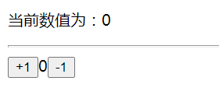

- # 学习目标

  - 能够使用函数创建组件 - 函数组件
  - 能够掌握 class 语法 extends 继承
  - 能够使用 class 创建组件-类组件
  - 能够给 React 元素绑定事件
  - 能够使用 state 与 setState
  - 能够处理事件中 this 的指向问题
  - 能够使用受控组件方式处理表单

  # 组件基本介绍

  - 组件是 React 中最基本的内容，使用 React 就是在使用组件
  - 组件表示页面中的部分功能
  - 多个组件可以实现完整的页面功能
  - 组件特点：可复用，独立，可组合

  

  # React 创建组件的两种方式

  ## 函数组件

  > 函数组件：使用 JS 的函数或者箭头函数创建的组件

  - 为了区分普通标签，函数组件的名称必须 `大写字母开头`
  - 函数组件`必须有返回值`，表示该组件的结构
  - 如果组件不渲染任何内容，可以返回 null

  使用函数创建组件

  ```jsx
  function Hello() {
    return <div>这是我的函数组件</div>;
  }
  ```

  使用箭头函数创建组件

  ```jsx
  const Hello = () => <div>这是一个函数组件</div>;
  ```

  使用组件

  ```jsx
  ReactDOM.render(<Hello />, document.getElementById('root'));
  ```

  ### 练习过程中的问题

  - return 后敲回车换行了，js 会在 reutrn 后插入分号结束。

  ## 类与继承

  ### class 基本语法

  - 在 ES6 之前通过构造函数创建对象
  - 在 ES6 中新增了一个关键字 class, 类 和构造函数类似，用于创建对象
    - 类与对象的区别
    - 类：指的是一类的事物，是个概念，比如车 手机 水杯等
    - 对象：一个具体的事物，有具体的特征和行为，比如一个手机，我的手机等， 类可以创建出来对象。
  - 类创建对象的基本语法
    - 基本语法`class 类名{ }`
    - 构造函数 `constructor` 的用法，创建对象
    - 在类中提供方法，直接提供即可
    - 💥💥 在类中不需要使用分号，分隔（Vue 因为是对象才需要分号分隔）

  ### extends 实现继承

  - extends 基本使用
  - 类可以使用它继承的类中所有的成员（属性和方法）
  - 类中可以提供自己的属性和方法
  - 注意：如果想要给类中新增属性，必须先调用 super 方法

  ### 注意

  1. 💥💥 在类中不需要使用分号，分隔（Vue 因为是对象才需要分号分隔）
  2. 类组件需要继承于 `React.Component`

## 类组件

> 类组件：使用 ES6 的 class 语法创建组件

约定 1：类组件的名称必须是大写字母开头

约定 2：类组件应该继承`React.Component`父类，从而可以使用父类中提供的方法或者属性

约定 3：类组件必须提供`render`方法，并返回组件的结构，如无需要返回的结构，返回 null

定义组件

```jsx
class Hello extends React.Component {
  render() {
    return <div>这是一个类组件</div>;
  }
}
```

使用组件

```jsx
ReactDOM.render(<Hello />, document.getElementById('root'));
```

## 将组件提取到单独的 js 文件中

思考：项目中的组件多了之后，该如何组织这些组件呢？

- 选择一：将所有组件放在同一个 JS 文件中

- 选择二：将每个组件放到单独的 JS 文件中

- **推荐选择二**-组件作为一个独立的个体，一般都会放到一个单独的 JS 文件中

实现方式

1. 创建 Hello.js
2. 创建组件（函数 或 类）
3. 在 Hello.js 中导出该组件
4. 在 index.js 中导入 Hello 组件
5. 渲染组件，

## 类组件的状态 state

- 状态`state`即数据，类似 Vue 中的 data，。
- React 同样是数据驱动视图 **更新 UI**，（同 Vue 的 data）。
- 状态`state` 是组件内部的`私有数据`，独立作用域，（同 Vue 的 data）。
- `state的值是一个对象`, 表示一个组件中可以有多个数据
- 早期，**只有类组件**，可以定义状态。【现在函数式组件，也可以定义状态】

- 简洁的语法

```jsx
class Hello extends React.Component {
  state = {
    msg: 'hello react',
  };
  render() {
    return <div>state中的数据--{this.state.msg}</div>;
  }
}
```

- 复杂的写法

```jsx
class Hello extends React.Component {
  constructor() {
    // 构造函数中，想使用this，super()必须调用
    super();
    // 组件通过state提供数据
    this.state = {
      msg: 'hello react',
    };
  }
  render() {
    return <div>state中的数据--{this.state.msg}</div>;
  }
}
```

**总结：**

1. `state = {}` 是固定的写法，独立作用域。
2. class 组件中才有声明`state` 的写法，函数组件中没有
3. 使用变量，通过`this.state.属性名` 的方式来访问
4. React 中同样是数据驱动视图，数据变化导致 UI 更新。
5. 早期，**只有类组件**，可以定义状态

## react 插件的安装（没网）

安装谷歌插件`react-devtools`

## 组件类型-有状态组件和无状态组件

- **无状态组件** : 早期，函数组件是不能自己提供数据【前提：基于 hooks 之前说的】
- **有状态组件** : 类组件可以自己提供数据，组件内部的状态（数据如果发生了改变，内容会自动的更新），数据驱动视图

**注意**：

- 现在函数组件也可以定义状态。【早期，函数组件是没有状态的】

* 在复杂的项目中，一般都是由函数组件和类组件共同配合来完成的。【class 增加了使用者的负担，所以后来有了 hooks】

# 事件处理

问题：React 中怎么给 DOM 绑定一个事件呢？

## 注册事件

React 注册事件与 DOM 的事件语法非常像

语法`on+事件名=｛事件处理程序｝` 比如`onClick={this.handleClick}`

注意：**React 事件采用驼峰命名法**，比如`onMouseEnter`, `onClick`

```jsx
class App extends React.Component {
  render() {
    return (
      <div>
        <button onClick={this.handleClick}>点我</button>
      </div>
    );
  }

  handleClick() {
    console.log('点击事件触发了');
  }
}
```

## 事件对象

- 可以通过事件处理函数的形参获取到事件对象

```jsx
function handleClick(e) {
  e.preventDefault();
  console.log('事件对象', e);
}
<a onClick={this.handleClick}>点我，不会跳转页面</a>;
```

ES6 箭头函数补充

1. 简写省略 return 与 {}。
2. return 后的语句会执行。
3. 箭头函数包一层传参。

## 事件传值

- 方法：包一层箭头函数，在箭头函数中，调用处理函数。
- 记忆口诀：加个箭头，变成箭头函数。

写法：

- 完整写法

```react
<a
    onClick={(e) => {
        this.handleClick(e, 'hello React')
    }}
>点我，不会跳转页面</a>
```

- 简写-**推荐**：省略了花括号，更利于阅读

```react
<a onClick={(e) => this.handleClick(e, 'hello React') }>点我，不会跳转页面</a>
```

## this 指向问题

> 事件处理程序中的 this 指向的是 undefined
>
> 1. render 方法中的 this 没有问题，指向当前 react 组件实例。
>
> 2. **只有事件处理函数中的 this 有问题**

```jsx
class App extends React.Component {
  state = {
    msg: 'hello react',
  };

  handleClick() {
    console.log(this.state.msg);
  }

  render() {
    return (
      <div>
        <button onClick={this.handleClick}>点我</button>
      </div>
    );
  }
}
```

## this 指向问题解决方案

```js
方案1：render中使用箭头函数
方案2：bind修改this指向
方案3：class箭头函数方法 - 推荐✅
```

- 解决方案 1：在 render 中使用箭头函数

箭头函数的特点：自身没有 this，访问的是外部的 this

```jsx
class App extends React.Component {
  state = {
    msg: 'hello react'
  }

  handleClick() {
    console.log(this.state.msg)
  }

  render() {
    return (
      <div>
        <button onClick={() => { console.log(this.state.msg) }>点我</button>
        <button onClick={() => {this.handleClick()}}>点我</button>
      </div>
    )
  }
}
```

缺点：会把大量的 js 处理逻辑放到 JSX 中，将来不容易维护

- 解决方案 2：使用 bind
- 原生 JS 复习：apply 和 call 改变 this 指向的同时，会直接调用函数
- 原生 JS 复习：bind 只是改变 this 指向，但不调用函数

```jsx
class App extends React.Component {
  state = {
    msg: 'hello react',
  };
  handleClick() {
    console.log(this.state.msg);
  }
  render() {
    return (
      <div>
        <button onClick={this.handleClick.bind(this)}>点我</button>
      </div>
    );
  }
}
```

- 解决方案 3：class 箭头函数方法 - 🔔**推荐**

```js
class App extends React.Component {
  state = {
    msg: 'hello react',
  };

  handleClick = () => {
    console.log(this.state.msg);
  };
  render() {
    return (
      <div>
        <button onClick={this.handleClick}>点我</button>
      </div>
    );
  }
}
```

**注意：这个语法是试验性的语法，但是有 babel 的转义，所以没有任何问题**

# setState 修改状态

问题：

1.  React 中可以修改状态`state` 吗？
2.  可以直接像 Vue 一样对状态赋值吗？

```react
class App extends React.Component {
  state = {
    count: 1
  }
  handleClick = () => {
  // 修改状态state
  }
  render() {
    return (
      <div>
        <p>次数: {this.state.count}</p>
        <button onClick={this.handleClick}>点我+1</button>
      </div>
    )
  }
}
```

- 组件中的状态是可变的
- 语法`this.setState({要修改的数据名: 新的值})`
- 注意：不要直接修改 state 中的值，必须通过`this.setState()`方法进行修改
- `setState`的作用

  - 修改 state
  - 更新 UI

- 思想：数据驱动视图

```jsx
class App extends React.Component {
  state = {
    count: 1,
  };
  handleClick() {
    this.setState({
      count: this.state.count + 1,
    });
  }
  render() {
    return (
      <div>
        <p>次数: {this.state.count}</p>
        <button onClick={this.handleClick.bind(this)}>点我+1</button>
      </div>
    );
  }
}
```

- react 中核心理念：**状态不可变**
  - 不要直接修改 react 中 state 的值，而是提供新的值
  - 直接修改 react 中 state 的值，组件并不会更新

```jsx
state = {
  count: 0,
  list: [],
};
// ❌错误操作：直接修改值的操作
this.state.count++;
this.state.list.push('a');

// ✅正确操作：创建新的值的操作
this.setState({
  count: this.state.count + 1,
  list: [...this.state.list, 'b'],
});
```

# 练习-购物车加减

> 要求：加减按钮，绑定同一个处理函数

效果如下：



基本的组件代码：

```
class App extends React.Component {
  state = {
    count: 0,
  };

  render() {
    return (
      <div>
        <p>当前数值为：{this.state.count}</p>
        <hr />
        <button>+1</button>
        <span>{this.state.count}</span>
        <button>-1</button>
      </div>
    );
  }
}

```

# 表单处理

> 我们在开发过程中，经常需要操作表单元素，比如获取表单的值或者是设置表单的值。

react 中处理表单元素有两种方式：

- 受控组件-表单元素的 value 受到 state 的控制，（类似 Vue 中的 v-model）
- 非受控组件（DOM 操作）

## 受控组件基本概念

- React 中将 state 中的数据与表单元素的 value 值绑定到了一起，`由state的值来控制表单元素的值`
- 但是在 react 中，可变状态通常是保存在 state 中的，并且要求状态只能通过`setState`进行修改。
- 受控组件：**value 值受到了 statet 控制的表单元素**


## 受控组件使用步骤

1. 在 state 中添加一个状态，作为表单元素的 value 值（控制表单元素的值）
2. 给表单元素添加 change 事件，设置 state 的值为表单元素的值（控制值的变化）

```js
class App extends React.Component {
  state = {
    msg: 'hello react',
  };

  handleChange = (e) => {
    this.setState({
      msg: e.target.value,
    });
  };

  render() {
    return (
      <div>
        <input type="text" value={this.state.msg} onChange={this.handleChange} />
      </div>
    );
  }
}
```

## 常见的受控组件

- 文本框、文本域、下拉框（操作 value 属性）
- 复选框（操作 checked 属性）

```js
class App extends React.Component {
  state = {
    usernmae: '',
    desc: '',
    city: '2',
    isSingle: true,
  };

  handleName = (e) => {
    this.setState({
      name: e.target.value,
    });
  };
  handleDesc = (e) => {
    this.setState({
      desc: e.target.value,
    });
  };
  handleCity = (e) => {
    this.setState({
      city: e.target.value,
    });
  };
  handleSingle = (e) => {
    this.setState({
      isSingle: e.target.checked,
    });
  };

  render() {
    return (
      <div>
        姓名：
        <input type="text" value={this.state.username} onChange={this.handleName} />
        <br />
        描述：<textarea value={this.state.desc} onChange={this.handleDesc}></textarea>
        <br />
        城市：
        <select value={this.state.city} onChange={this.handleCity}>
          <option value="1">北京</option>
          <option value="2">上海</option>
          <option value="3">广州</option>
          <option value="4">深圳</option>
        </select>
        <br />
        是否单身：
        <input type="checkbox" checked={this.state.isSingle} onChange={this.handleSingle} />
      </div>
    );
  }
}
```

总结：

1. `react` 中`change` 事件等同于 html 中的`input` 事件。
2. `react`中的`blur` 事件，等同于 html 中的`change` 事件。
3. **推荐**使用`onChange` 事件监听用户输入，**不推荐**使用`onInput`。

## 多表单元素的优化

问题：每个表单元素都需要一个单独的事件处理程序，处理太繁琐

优化：使用一个事件处理程序处理多个表单元素

步骤

- 给表单元素添加 name 属性，名称与 state 属性名相同
- 根据表单元素类型获取对应的值
- 在事件处理程序中通过`[name]`修改对应的 state

```js
class App extends React.Component {
  state = {
    username: '',
    desc: '',
    city: '2',
    isSingle: true,
  };

  handleChange = (e) => {
    let { name, type, value, checked } = e.target;
    console.log(name, type, value, checked);
    value = type === 'checkbox' ? checked : value;
    console.log(name, value);
    this.setState({
      [name]: value,
    });
  };
  render() {
    return (
      <div>
        姓名：
        <input
          type="text"
          name="username"
          value={this.state.username}
          onChange={this.handleChange}
        />
        <br />
        描述：<textarea name="desc" value={this.state.desc} onChange={this.handleChange}></textarea>
        <br />
        城市：
        <select name="city" value={this.state.city} onChange={this.handleChange}>
          <option value="1">北京</option>
          <option value="2">上海</option>
          <option value="3">广州</option>
          <option value="4">深圳</option>
        </select>
        <br />
        是否单身：
        <input
          type="checkbox"
          name="isSingle"
          checked={this.state.isSingle}
          onChange={this.handleChange}
        />
      </div>
    );
  }
}
```

## 非受控组件-ref

> 表单元素的 value 由 DOM 对象控制，不受 state 的控制

思考：

1. 除了使用`state` 控制表单的数据，是否有其它的方式？

```react
/**
 * 学习目标：了解非受控组件 - 真实DOM具备管理表单数据的能力
 * 含义：非受控组件-组件内，表单的数据可，可以不受state的控制
 */
import React from 'react';
import ReactDOM from 'react-dom';

class App extends React.Component {
  handleClick = () => {
    // 这种不需要state管理数据的表单元素，称之为非受控组件，
    // 获取数据：
    let data = {
      userName: document.querySelector('#username').value,
      desc: document.querySelector('#desc').value,
      city: document.querySelector('#city').value,
      isSingle: document.querySelector('#isSingle').checked,
    };

    console.log(data, 'data');
  };

  handleChange = (e) => {
    // 修改数据
    console.log(e.target.value, 'value');
  }

  render() {
    return (
      <div>
        姓名：
        <input type="text" name="username" id="username" />
        <br />
        描述：<textarea name="desc" id="desc"></textarea>
        <br />
        城市：
        <select name="city" id="city">
          <option value="1">北京</option>
          <option value="2">上海</option>
          <option value="3">广州</option>
          <option value="4">深圳</option>
        </select>
        <br />
        是否单身：
        <input name="isSingle" type="checkbox" id="isSingle" />
        <button onClick={this.handleClick}>点击提交到后台</button>
      </div>
    );
  }
}

ReactDOM.render(<App />, document.getElementById('root'));

```

**总结：**

1. 真实 DOM 具备存获取表单数据、修改表单数据的能力
2. 表单元素，它的值由 DOM 控制，不使用 state 控制，称为非受控组件。
3. 表单元素，它的值由 state 控制，由 setState 来改变，称为受控组件。
4. **推荐-**使用受控组件，React 推荐数据驱动视图。

## Ref

**作用：获取组件实例、获取 DOM** （作用与 Vue 中的 Ref 相同)

目标：使用 Ref 获取文本框的 DOM 元素

使用步骤：

1. 调用`React.createRef()`方法创建一个 ref 对象，用于关联模板中的某个元素，在模板渲染完毕后可以通过 ref 对象访问到模板中的元素。

```js
txtRef = React.createRef();
```

2. 将创建好的 ref 对象添加到文本框中

```js
<input type="text" ref={this.txtRef} />
```

3. 通过 ref 对象获取文本框的值

```js
handleClick = () => {
  console.log(this.txtRef.current.value);
};
```

总结：

1. 作用：获取组件实例、DOM 对象。 （与 Vue 中的 ref，在作用上相同）
2. ref 的价值在于获取 **组件实例对象**。
3. 使用步骤：
   1. 创建 ref 对象
   2. 绑定到组件或 DOM 上
   3. 使用`this.ref对象.current` 获取组件或 DOM

# 综合案例

评论列表案例

静态结构如下：

1. 新建`src/index.js`
2. 新建`src/index.css`

代码如下，直接复制：

`src/index.js`

```react
import React from 'react';
import ReactDOM from 'react-dom';

import './index.css';

class App extends React.Component {
  state = {
    // 用户名输入框
    username: '',
    // 评论内容
    content: '',
  };

  render() {
    return (
      <div className="app">
        {/* 表单提交的时候，运行发布评论的函数 */}
        <form onSubmit={this.handlePublish}>
          <input className="user" type="text" placeholder="请输入评论人" />
          <br />
          <textarea className="content" cols="30" rows="10" placeholder="请输入评论内容" />
          <br />
          <button>发表评论</button>
          <button type="button">清空评论</button>
        </form>
        <ul>
          <li>
            <h3>评论人: xxx</h3>
            <p>评论内容：xxx</p>
            <button>删除</button>
          </li>
        </ul>
      </div>
    );
  }
}

// 渲染组件
ReactDOM.render(<App />, document.getElementById('root'));

```

`src/index.css`

```css
.app {
  width: 300px;
  padding: 10px;
  border: 1px solid #999;
}

.user {
  width: 100%;
  box-sizing: border-box;
  margin-bottom: 10px;
}

.content {
  width: 100%;
  box-sizing: border-box;
  margin-bottom: 10px;
}

.no-comment {
  text-align: center;
  margin-top: 30px;
}
```

## 列表展示功能

渲染评论列表（列表渲染）

- 在 state 中初始化评论列表数据
- 使用数组的 map 方法遍历列表数据
- 给每个 li 添加 key 属性

## 发表评论功能

获取评论信息，评论人和评论内容（受控组件）

- 使用受控组件的方式获取评论数据

发表评论，更新评论列表（更新状态）

- 给 list 增加一条数据

边界处理

- 清空内容
- 判断非空

## 删除一条评论

- 给删除按钮，绑定事件处理函数
- 事件函数中，通过 id 或 index，删除 list 中一条数据

## 清空评论功能

- 给清空评论按钮注册事件
- 通过 setState 清空评论列表
- 没有更多评论的处理

##
