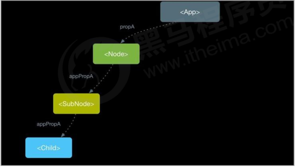
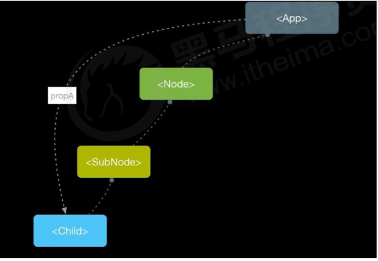
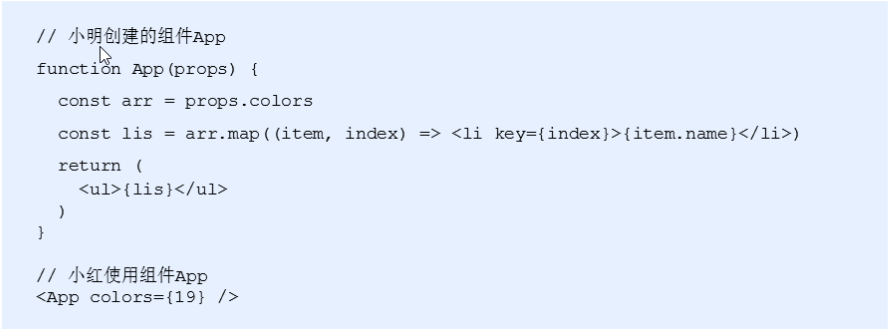

# 学习目标

- 组件通讯-介绍以及为什么要有组件通讯
- 组件的 props
- 组件通讯的三种方式 父传子 子传父 兄弟组件
- Context 组件通讯
- props 深入

# 组件通讯

**组件**是**独立作用域**，默认情况下，只能使用组件自己的数据。在组件化过程中，我们将一个完整的功能
拆分成多个组件，以更好的完成整个应用的功能。而在这个过程中，**多个组件**之间不可避免的**要共享某些数据**
。为了实现这些功能，就需要打破组件的独立封闭性，让其与外界沟通。这个过程就是**组件通讯**。

## props

- 组件是封闭的，要接收外部数据应该通过 props 来实现
- **props 的作用：接收传递给组件的数据**
- props 名字的由来：属性-property 单词的缩写`prop` , `+ s`
- 传递数据：给组件标签添加属性
- 接收数据：函数组件通过参数 props 接收数据，类组件通过 this.props 接收数据

### 函数组件通讯

子组件

```js
function Hello(props) {
  console.log(props);
  return <div>接收到数据：{props.name}</div>;
}
```

父组件

```js
<Hello name="jack" age={19} />
```

### 类组件通讯

子组件

```js
class Hello extends React.Component {
  render() {
    return <div>接收到的数据：{this.props.age}</div>;
  }
}
```

父组件

```js
<Hello name="jack" age={19} />
```

### props 的特点

- 可以给组件传递任意类型的数据，包括虚拟 DOM 结构
- props 是只读的，不允许修改 props 的数据 - **单向数据流**

## 组件通讯三种方式

- 父传子
- 子传父
- 兄弟组件

### 父传子

1. 父组件提供要传递的 state 数据
2. 给子组件标签添加属性，值为 state 中的数据
3. 子组件中通过 props 接收父组件中传递的数据

父组件提供数据并且传递给子组件

```js
class Parent extends React.Component {
  state = { lastName: '王' };
  render() {
    return (
      <div>
        传递数据给子组件：
        <Child name={this.state.lastName} />
      </div>
    );
  }
}
```

子组件接收数据

```js
function Child(props) {
  return <div>子组件接收到数据：{props.name}</div>;
}
```

###

### 子传父

思路：利用回调函数，父组件提供回调，子组件调用，将要传递的数据作为回调函数的参数。

1. 父组件提供一个回调函数（用于接收数据）
2. 将该函数作为标签属性的值，传递给子组件
3. 子组件通过 props.语法找到函数，再 调用回调函数
4. 将子组件的数据作为参数传递给回调函数

使用步骤：

父组件提供函数，并且通过标签属性，传递给子组件

```js
class Parent extends React.Component {
  state = {
    money: 0,
  };

  handleMakeMoney = () => {
    this.setState({
      money: 1000 + this.state.money,
    });
  };

  // 1. 在父组件中准备一个函数
  handleCost = (num) => {
    this.setState({
      money: this.state.money - num,
    });
  };

  render() {
    return (
      <div>
        <button onClick={this.handleMakeMoney}>爸爸开始赚钱了</button>
        {/* 2. 将函数通过props，传给子组件 */}
        <Child money={this.state.money} handleCost={this.handleCost}></Child>
      </div>
    );
  }
}
```

子组件接收函数并且调用

```js
class Child extends React.Component {
  handleChildCost = () => {
    //  3. 在子组件内，通过props.语法找到对应的函数
    //  4. 在组件内，通过()的方式，直接调用函数, 可以直接传参
    this.props.handleCost(1000);
  };

  render() {
    const { money } = this.props;

    return (
      <div>
        <h1>爸爸给我钱了： {money}</h1>
        <button onClick={this.handleChildCost}>点击我，儿子要花爸爸的钱了</button>
      </div>
    );
  }
}
```

**注意：回调函数中 this 指向问题！**

### 兄弟组件

- 将共享状态提升到最近的公共父组件中，由公共父组件管理这个状态
- 思想：**状态提升**
- 公共父组件职责：
  - 提供共享状态
  - 提供操作共享状态的方法
- 要通讯的子组件只需通过 props 接收状态或操作状态的方法

状态提升前


状态提升之后


状态提升练习：

`components/Husband.js`

```react
import React, { Component } from 'react';

export default class Husband extends Component {
  state = {
    money: 0,
  };

  /* 赚钱方法 */
  handleMakeMoney = () => {
    this.setState({ money: this.state.money + 1000 });
  };

  render() {
    return (
      <div style={{ padding: '10px', border: '10px solid #ccc' }}>
        <h1>老公的钱: {this.state.money}</h1>
        <button onClick={this.handleMakeMoney}>老公赚钱</button>
      </div>
    );
  }
}

```

`components/Wife.js`

```
import React, { Component } from 'react';

export default class Wife extends Component {
  /* 花钱方法 */
  handleCostMoney = () => {
    // 想要花点老公赚的钱
  };

  render() {
    return (
      <div style={{ padding: '10px', border: '10px solid #ccc' }}>
        <button onClick={this.handleCostMoney}>老婆开始花钱</button>
      </div>
    );
  }
}

```

`App.js`

```
import React, { Component } from 'react';
import Husband from './components/Husband';
import Wife from './components/Wife';

export default class App extends Component {
  render() {
    return (
      <div>
        <h1 style={{ textAlign: 'center' }}>家庭存款：</h1>
        <Husband></Husband>
        <hr />
        <Wife></Wife>
      </div>
    );
  }
}

```

## 组件通讯-context - 跨组价通信

### 基本概念

思考：App 组件要传递数据给 Child 组件，该如何处理？



处理方式：使用 props 一层层组件往下传递（繁琐）

更好的姿势：使用 Context

作用：跨组件传递数据（比如：主题、语言等）



`App.js` 直接复制如下静态结构

```
/*
  目标： 使用Context来跨组价通信，让App组件-直接传数据给SonSon组件
*/
export default class App extends React.Component {
  render() {
    return (
      <div>
        <h1>父组件</h1>
        <Son></Son>
      </div>
    );
  }
}

class Son extends Component {
  render() {
    return (
      <div>
        <h2> 儿子</h2>
        <SonSon></SonSon>
      </div>
    );
  }
}

class SonSon extends Component {
  render() {
    return (
      <div>
        <h2> 孙子</h2>
      </div>
    );
  }
}

```

### 实现步骤

- 调用 React. createContext() 创建 Provider（提供数据） 和 Consumer（消费数据） 两个**组件**。

```js
const { Provider, Consumer } = React.createContext();
```

- 使用 Provider 组件作为父节点。

```js
<Provider>
  <div className="App">
    <Child1 />
  </div>
</Provider>
```

- 设置 value 属性，表示要传递的数据。

```js
<Provider value="pink">
```

- 调用 Consumer 组件接收数据。

```js
<Consumer>{(data) => <span>data参数表示接收到的数据 -- {data}</span>}</Consumer>
```

总结：

1. 如果两个组件是远方亲戚（比如，嵌套多层）可以使用 Context 实现组件通讯
2. Context 提供了两个组件：Provider 和 Consumer
3. Provider 组件：用来存入数据
4. Consumer 组件：用来取出数据

### Context 的优缺点及常见使用场景

优点：React 自带，不需要借助其它包，即可跨组件通信

缺点：Provider 和 Consumer 增加嵌套结构，代码理解成本加大。

UI 库中：

1. 多语言切换

2. 一键换色

## redux - vuex

后续学习

# props 深入

## children 属性 - Vue 中的插槽

children 属性：表示该组件的子节点，只要组件有子节点，props 就有该属性

children 属性与普通的 props 一样，值可以是任意值（文本、React 元素、组件，甚至是函数）

```js
function Hello(props) {
  return <div>该组件的子节点：{props.children}</div>;
}

<Hello>我是子节点</Hello>;
```

## props 校验

目的：校验接收的 props 的数据类型，增加，

对于组件来说，props 是外来的，无法保证组件使用者传入什么格式的数据

如果传入的数据格式不对，可能会导致组件内部报错。**组件的使用者不能很明确的知道错误的原因。**



props 校验允许在创建组件的时候，就约定 props 的格式、类型等


作用：规定接收的 props 的类型必须为数组，如果不是数组就会报错，增加组件的**健壮性**。


### 使用步骤

1. 导入 prop-types 包 （不用下载，脚手架自带）
2. 使用：`组件名.propTypes = {}` 来给组件的 props 添加校验规则对象
3. 规则的数据类型，通过 `PropTypes` 对象来指定

```js
import PropTypes from 'prop-types';
function App(props) {
  return <h1>Hi, {props.colors}</h1>;
}
App.propTypes = {
  // 约定colors属性为array类型
  // 如果类型不对，则报出明确错误，便于分析错误原因
  colors: PropTypes.array,
};
```

### 约束规则

1. 常见类型：array、bool、func、number、object、string
2. React 元素类型：element
3. 必填项：isRequired
4. 特定结构的对象：shape

```js
// 常见类型
optionalFunc: PropTypes.func,
// 必选
requiredFunc: PropTypes.func.isRequired,
// 特定结构的对象
optionalObjectWithShape: PropTypes.shape({
	color: PropTypes.string,
	fontSize: PropTypes.number
})
```

注意：函数式组件的校验，语法上没有什么不同。

## props 默认值

作用：给 props 设置默认值，在未传入 props 时生效

```js
function App(props) {
    return (
        <div>
            此处展示props的默认值：{props.pageSize}
        </div>
    )
}
// 设置默认值
App.defaultProps = {
	pageSize: 10
}
// 不传入pageSize属性
<App />
```

## 类的静态属性 static

- 实例成员: 通过实例对象，范文的属性或者方法，，，叫做实例成员（属性或者方法）

- 静态成员：通过类或者构造函数本身，才能访问的属性或者方法

```jsx
class Person {
  name = 'zs';
  age = 18;
  sayHi() {
    console.log('哈哈');
  }
  goodBye() {
    console.log('byebye');
  }
}
```
