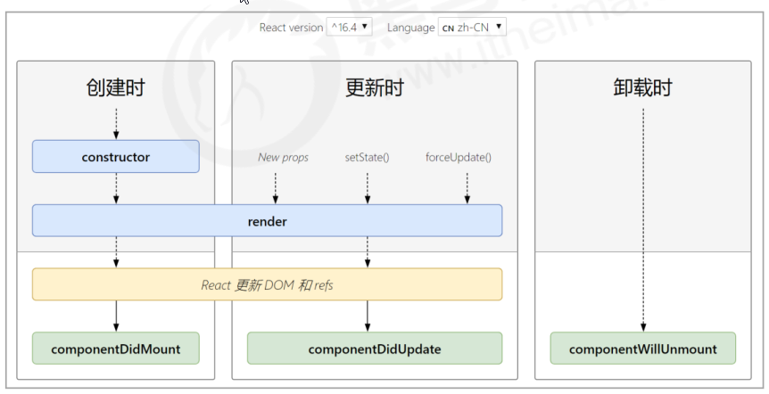

# 组件的生命周期 -

## 概述

- 意义：组件的生命周期有助于理解组件的运行方式、完成更复杂的组件功能、分析组件错误原因等
- 组件的生命周期：组件从被创建到挂载到页面中运行，再到组件不用时卸载的过程
- 钩子函数的作用：为开发人员在不同阶段操作组件提供了时机。
- **只有 类组件 才有生命周期。**

## 生命周期的整体说明

- 每个阶段的执行时机
- 每个阶段钩子函数的执行顺序
- 每个阶段钩子函数的作用
- <http://projects.wojtekmaj.pl/react-lifecycle-methods-diagram/>

## 创建阶段

执行时机：组件创建时（页面加载时）

执行顺序：

| 钩子 函数         | 触发时机                    | 作用                           |
| ----------------- | --------------------------- | ------------------------------ |
| constructor       | 创建组件时，最先执行        | 1. 初始化 state 2. 创建 Ref 等 |
| render            | 每次组件渲染都会触发        | 渲染 UI                        |
| componentDidMount | 组件挂载（完成 DOM 渲染）后 | 1. 发送网络请求 2.DOM 操作     |

## 更新阶段

- 执行时机：1. setState() 2. 组件接收到新的 props、 3. forceUpdate() - 不常用
- 说明：以上三者任意一种变化，组件就会重新渲染
- 执行顺序

| 钩子函数           | 触发时机             | 作用                                                                      |
| ------------------ | -------------------- | ------------------------------------------------------------------------- |
| render             | 每次组件渲染都会触发 | 渲染 UI（与 挂载阶段 是同一个 render）（**注意： 不能调用 setState()** ） |
| componentDidUpdate | 数据更新-组件更新    | DOM 操作，可以获取到更新后的 DOM 内容，**不要调用 setState**              |

**总结：**

1. 触发组件更新的方式（常用），两种：
   1. props 值的改变
   2. setState()改变 state
2. 更新阶段触发的钩子函数，有两个
   1. render
   2. componentDidUpdate

**注意：**

1. 不论 DOM 中有没有使用数据，钩子函数都会被触发。（与 vue 不同）
2. react 中的更新，指的是数据更新，而非视图更新。（与 vue 不同）

## 卸载阶段

- 执行时机：组件从页面中消失

| 钩子函数             | 触发时机                 | 作用                               |
| -------------------- | ------------------------ | ---------------------------------- |
| componentWillUnmount | 组件卸载（从页面中消失） | 执行清理工作（比如：清理定时器等） |

# todo 案例优化

1. 组件拆分
2. 渲染任务列表
3. 更新数据-设置选中状态、处理样式
4. 删除一条数据功能
5. Footer 点谁谁有边框
6. Footer 点击切换数据
7. Footer 清空数据
8. 剩余任务的功能
9. Header 改造为受控组件
10. 回车新增功能

    1. ESC 取消输入内容
    2. 新增空，清空输入框
    3. 数据不能为空，提示用户

11. 本地缓存数据
    1. 缓存 list
    2. 缓存 type
12. 全选功能
    1. 小选影响全选
    2. 全选影响小选

day04 结束
