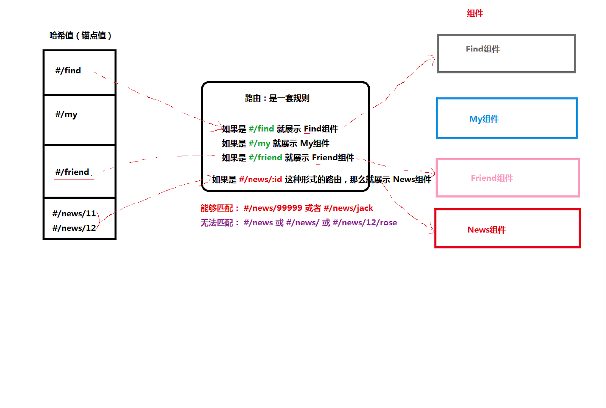

# 单页应用程序

- SPA： `Single Page Application`  单页面应用程序，整个应用中只有一个页面（index.html）
- MPA : `Multiple Page Application`多页面应用程序，整个应用中有很多个页面（*.html）

[SPA ](https://baike.baidu.com/item/SPA/17536313?fr=aladdin)
[网易云音乐](https://music.163.com/)

## 优势

1. 加快页面响应速度，降低了对服务器的压力
   - 传统的多页面应用程序，每次请求服务器返回的都是一整个完整的页面
   - 单页面应用程序只有第一次会加载完整的页面，以后每次请求仅仅获取必要的数据
2. 更好的用户体验，运行更加流畅


## 缺点

**不利于 SEO** 搜索引擎优化 

- 因为 爬虫 只爬取 HTML 页面中的文本内容，不会执行 JS 代码
- 可以通过 SSR（服务端渲染 Server Side Rendering）来解决 SEO 问题
  - 解释：先在服务器端把内容渲染出来，然后，返回给浏览器的就是纯 HTML 内容了
- 页面静态化，比如，对于一个电商应用可以为每一个商品生产一个静态的HTML页面，静态 HTML 页面中是带有文字内容的，所以，有利于 SEO 的

---


# React 路由

- React 路由介绍
- 路由的基本使用
- 路由的执行过程
- 路由的常用操作

## React 路由介绍

现代的前端应用大多都是 SPA（单页应用程序），也就是只有一个 HTML 页面的应用程序。因为它的用户体验更好、对服务器的压力更小，所以更受欢迎。为了**有效的使用单个页面来管理原来多页面的功能，前端路由应运而生**。前端路由的功能：让用户从一个视图（页面）导航到另一个视图（页面）

- 前端路由是一套**映射规则**，在React中，是 *URL路径* 与 *组件* 的对应关系 
- 使用 React 路由简单来说就是：配置路径和组件（配对）




## 模拟路由的实现

```jsx
import React, { PureComponent } from 'react'
import ReactDOM from 'react-dom'
import Home from './pages/Home'
import My from './pages/My'
import Friend from './pages/Friend'
class App extends PureComponent {
  state = {
    currentHash: '',
  }
  // hashchange: 锚点值（hash）改变就会触发
  componentDidMount() {
    // 注册事件， 注意hashchange不要写成驼峰式，这是原生JS的语法
    window.addEventListener('hashchange', () => {
      console.log('hash值变了', window.location.hash)
      this.setState({
        currentHash: window.location.hash.slice(1),
      })
    })
  }
  render() {
    const { currentHash } = this.state
    return (
      <div>
        <h1>app组件</h1>
        <ul>
          <li>
            <a href="#/home">首页</a>
          </li>
          <li>
            <a href="#/my">我的音乐</a>
          </li>
          <li>
            <a href="#/friend">我的朋友</a>
          </li>
        </ul>
        {currentHash === '/home' && <Home></Home>}
        {currentHash === '/my' && <My></My>}
        {currentHash === '/friend' && <Friend></Friend>}
      </div>
    )
  }
}

// 渲染组件
ReactDOM.render(<App />, document.getElementById('root'))

```


## Vue路由复习

1. 下包 vue-router、导入VueRouter

2. 配置规则对象数组：

   1. ```
      [{
         path: "/home"，
         component: Home，
         children: [
          path: "index"
         ]
      }]
      ```

3. 实例化路由：new VueRouter()

4. 设置挂载点 router-view

5. 跳转路径：router-link


# 路由基本使用

官网：https://reactrouter.com/


## 基本步骤

+ 安装

```js
yarn add react-router-dom@5.3
npm i react-router-dom@5.3
```

+ `react-router-dom`这个包提供了三个核心的组件

```js
import { HashRouter, Route, Link } from 'react-router-dom'
```

+ 使用`HashRouter`包裹整个应用，一个项目中只会有一个Router

```js
<HashRouter>
    <div className="App">
    // … 省略页面内容
    </div>
</HashRouter>
```

+ 使用Link指定导航链接

```js
<Link to="/first">页面一</Link>
<Link to="/two">页面二</Link>
```

+ 使用`Route`指定路由规则

```js
// 在哪里写的Route,最终匹配到的组件就会渲染到这
<Route path="/first" component={First}></Route>
```


注意：

1. 💥使用Router包住整个应用，一般项目中只会有一个Router。
2. 💥 Route写在Router之内，不能写在Router之外。


## Router详细说明

+ Router 组件：包裹整个应用，一个 React 应用只需要使用一次
+ 两种常用 Router：`HashRouter` 和 `BrowserRouter`  
+ HashRouter：使用 URL 的哈希值实现（http://localhost:3000/#/first）
  - 原理：监听 window 的 `hashchange` 事件来实现的
+ （推荐）BrowserRouter：使用 H5 的 history API 实现（http://localhost:3000/first）
  - 原理：监听 window 的 `popstate` 事件来实现的


👍 最佳实践： 使用as语法将重命名为Router

```js
import { HashRouter as Router, Route, Link } from 'react-router-dom'
// import { BrowserRouter as Router, Route, Link } from 'react-router-dom'
```


## Link与NavLink 

`Link`组件最终会渲染成a标签，用于指定路由导航

+ to属性，将来会渲染成a标签的href属性
+ `Link`组件无法实现导航的高亮效果

`NavLink`组件，一个更特殊的`Link`组件，可以用用于指定当前导航高亮

+ to属性，用于指定地址，会渲染成a标签的href属性
+ activeClassName: 用于指定高亮的类名，默认`active`
+ exact: 精确匹配，表示必须精确匹配类名才生效


注意：

1. 👍 推荐： 使用LInk NavLink替代a标签.
   1. `Link`  `NavLink` 会根据路由模式，自动判断是否加#。
   2. a标签不会。


## Route

- path 的说明
  - 如果 path 的路径匹配上了，那么就可以对应的组件就会被 render
  
  - 如果 path 没有匹配上，那么会 render null
  
  - **默认情况下，path="/"**   => 能够匹配任意/开始的路径
  
  - **如果没有指定 path**，那么一定会被渲染
  
- exact 的说明， exact 表示精确匹配某个路径

  `<Route exact path="/login" component={Login}/>` 


## Switch与404


+ 通常，👍 我们会把`Route`包裹在一个`Switch`组件中。

+ 在`Switch`组件中，匹配到第一个匹配的组件，停止向下匹配。
+ `<Route>`不写`path`，配合`<Switch>` 实现404页面的提示

```js
<Switch>
  <Route exact path="/" component={Home}/>
  <Route path="/about" component={About}/>
  <Route path="/user" component={User}/>
   //<Route>不写`path`，配合`<Switch>` 实现404页面的提示
  <Route component={NoMatch}/>
</Switch>
```


```
<Redirect path='/' to='/home'} />
```

# 嵌套路由的配置

+ 在React中，配置嵌套路由非常的简单，因为`Route`就是一个组件，可以在任意想配置的地方进行配置

+ 但是配置嵌套路由的时候，需要对路径进行处理，必须要先匹配到父级路由，才能匹配到子路由

```js
// 通过/home可以匹配Home父组件  再通过/list匹配子组件
<Route path="/home/list" component={List} />
```


注意：

+ 子组件中不需要再设置<Router>
+ 子组件中有多个路由 ，👍推荐使用<Switch> 组件包裹所有的<Router> 组价


# 编程式导航 

+  场景：点击登录按钮，登录成功后，通过代码跳转到后台首页，如何实现？
+  编程式导航：通过 JS 代码来实现页面跳转
+  history 是 React 路由提供的，用于获取浏览器历史记录的相关信息。通过props.history获取。
+  push(path)：跳转到某个页面，参数 path 表示要跳转的路径
+  go(n)： 前进或后退到某个页面，参数 n 表示前进或后退页面数量（比如：-1 表示后退到上一页）

```js
class Login extends Component {
    handleLogin = () => {
        // ...
        this.props.history.push('/home')
    }
    render() {...省略其他代码}
}
```


注意：

1. 💥只有被<Route component={组件名}> 设置过路径的组件，props上才有history。
2. 💥`HashRoute` 与`BroswerRoute` 两种模式下都具有history


总结：

1. `history` 属性 是 `React 路由` 提供的，通过`props.history` 获取。
2. `history.push('/路径名')` ：表示跳转到指定的路径。
3. `history.go(n)`  表示前进或后退。参数 n 表示前进或后退页面数量（比如：-1 表示后退到上一页）


# 动态路由与路由参数获取

+ 可以使用`:id`的方式来配置动态的路由参数

```js
// 可以匹配 /users/1  /users/2  /users/xxx
<Route path="/users/:id" component={Users} />
```

+ 在组件中，通过`props`可以接收到路由的参数

```js
render(){
    console.log(this.props.match.params)
}
```


