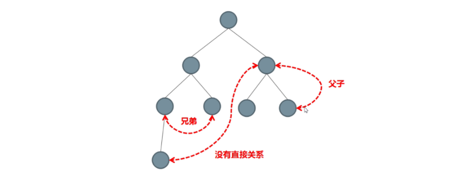
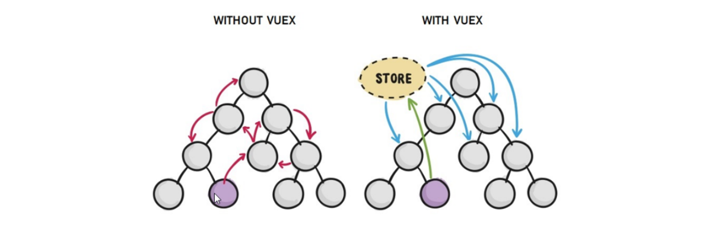
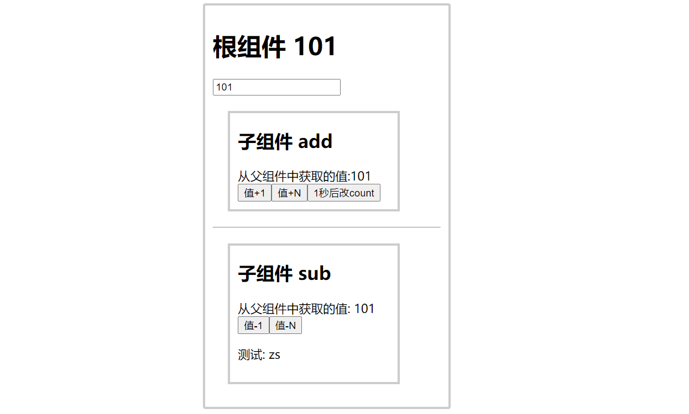
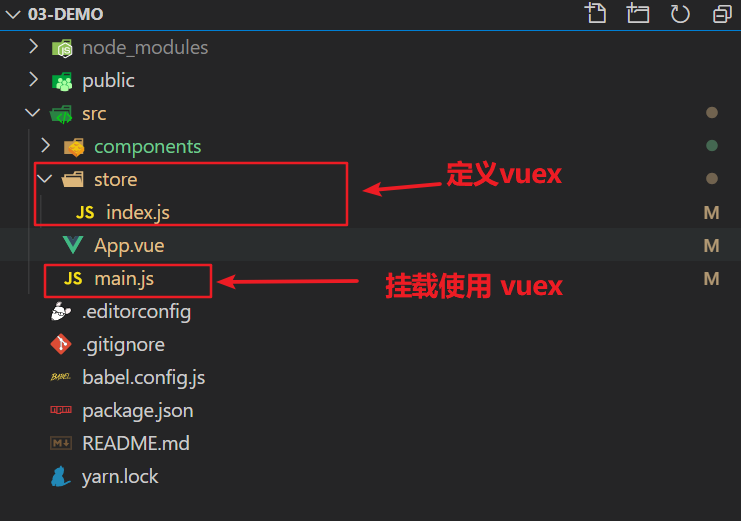
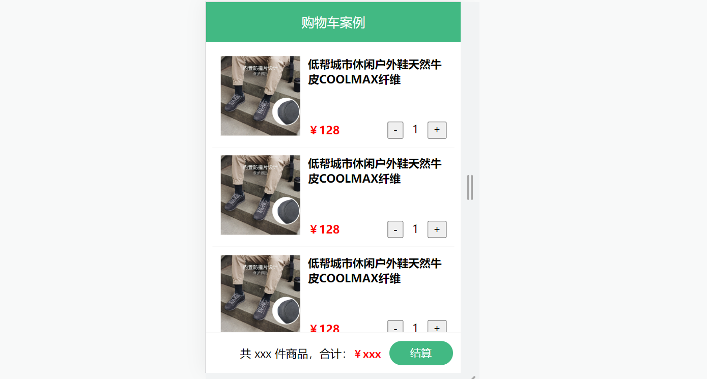

# vuex 概述

目标：

- 了解 vuex 的应用场景 (在哪用)
- 掌握 vuex 的基本使用 (怎么用)

**vuex 是一个 vue 的状态管理工具, 状态就是数据**

vuex 是一个插件工具，可以帮我们 vue 管理通用的数据

之前如果要进行跨组件的数据通信 => 父传子，子传父 => 一旦组件关系复杂，数据非常难以维护

## 回顾-组件之间共享状态 (组件通信方案)

默认组件的数据, 是独立的, 每个组件有着自己的状态(数据)

> 状态 === 数据



组件之间共享状态的两种典型方式：

- 父子之间 : props + $emit

  父传子：props 属性绑定

  ```
  <son1 msg="msg"></son1>
  ```

  子传父：$emit 事件绑定

  ```
  <div>
  	<button @click="$emit('event-name')">通知父组件</button>
  </div>
  ```

如果某个状态需要在很多个组件来使用，或者要实现多个组件共同维护一份数据又应该怎么做呢 ？

这里就要引入 Vuex 了。

## vuex 基本概念

[中文文档](https://vuex.vuejs.org/zh/guide/)

vuex 是 vue 的状态管理工具，**状态即数据**。 状态管理就是集中管理 vue 中 **通用的** 一些数据

注意（官方原文）：

- 不是所有的场景都适用于 vuex，只有在必要的时候才使用 vuex
- 使用了 vuex 之后，会附加更多的框架中的概念进来，增加了项目的复杂度 （数据的操作更便捷，数据的流动更清晰）

Vuex 就像《近视眼镜》, 你自然会知道什么时候需要用它~

## vuex 的优点: 方便的解决多组件的共享状态

vuex 的作用是解决《多组件状态共享》的问题。

- 它是独立于组件而单独存在的，所有的组件都可以把它当作 **一座桥梁** 来进行通讯。

- 特点：

  - **响应式**： 只要仓库一变化，其他所有地方都更新 （太爽了！！！）
  - 操作更简洁

  代码量非常少, 但是需要熟悉



## 什么数据适合存到 vuex 中

一般情况下，只有 **多个组件均需要共享的数据** ，才有必要存储在 vuex 中，

对于某个组件中的私有数据，依旧存储在组件自身的 data 中。

例如：

- 对于所有组件而言，当前登陆的 **用户信息** 是需要在全体组件之间共享的，则它可以放在 vuex 中
- 对于文章详情页组件来说，当前的用户浏览的文章列表数据则应该属于这个组件的私有数据，应该要放在这个组件 data 中。

## 概述小结:

1. vuex 解决什么问题? vuex 能解决 **多组件共享数据** 的问题, 非常方便便捷
2. 什么样的数据, 适合存放到 vuex? 多组件的 **通用** 的共用数据, 适合存到 vuex

vuex 两大优势:

1. 响应式变化
2. 操作简洁 (vuex 提供了一些简化语法的辅助函数, 这些辅助函数, 需要熟练掌握)

# vuex 入门

## 需求: 多组件共享数据

对于如下三个组件（一个父组件，两个子组件）



效果是三个组件共享一份数据:

- 任意一个组件都可以修改数据
- 三个组件的数据是同步的

1 创建项目

```
vue create vuex-demo
```

2 创建三个组件, 目录如下

```
|-components
|--add-item.vue
|--sub-item.vue
|-App.vue
```

3 源代码如下

`App.vue`在入口组件中引入 add-item 和 sub-item 这两个子组件

```html
<template>
  <div id="app">
    <h1>根组件</h1>
    <input type="text" />
    <add-item></add-item>
    <hr />
    <sub-item></sub-item>
  </div>
</template>

<script>
  import AddItem from "./components/add-item.vue";
  import SubItem from "./components/sub-item.vue";

  export default {
    name: "app",
    data: function () {
      return {};
    },
    components: {
      AddItem,
      SubItem,
    },
  };
</script>

<style>
  #app {
    width: 600px;
    margin: 20px auto;
    border: 3px solid #ccc;
    border-radius: 3px;
    padding: 10px;
  }
</style>
```

`main.js`

```js
import Vue from "vue";
import App from "./App.vue";

Vue.config.productionTip = false;

new Vue({
  render: (h) => h(App),
}).$mount("#app");
```

`sub-item.vue`

```html
<template>
  <div class="box">
    <h2>子组件 sub</h2>
    从vuex中获取的值: <label></label>
    <br />
    <button>值-1</button>
  </div>
</template>

<script>
  export default {
    name: "SubItem",
  };
</script>

<style lang="css" scoped>
  .box {
    border: 3px solid #ccc;
    width: 400px;
    padding: 10px;
    margin: 20px;
  }
  h2 {
    margin-top: 10px;
  }
</style>
```

`add-item.vue`

```html
<template>
  <div class="box">
    <h2>子组件 add</h2>
    从vuex中获取的值:<label></label>
    <br />
    <button>值+1</button>
  </div>
</template>

<script>
  export default {
    name: "AddItem",
  };
</script>

<style lang="css" scoped>
  .box {
    border: 3px solid #ccc;
    width: 400px;
    padding: 10px;
    margin: 20px;
  }
  h2 {
    margin-top: 10px;
  }
</style>
```

## vuex 的使用 - 创建仓库

1 安装 vuex, 与 vue-router 类似，vuex 是一个独立存在的插件，如果脚手架初始化没有选 vuex，就需要额外安装。

```
yarn add vuex@3.4.0
```

2 新建 `store/index.js` 专门存放 vuex

​ 为了维护项目目录的整洁，在 src 目录下新建一个 store 目录其下放置一个 index.js 文件。 (和 `router/index.js` 类似)

​ 

3 创建仓库 `store/index.js`

```jsx
// 导入 vue
import Vue from "vue";
// 导入 vuex
import Vuex from "vuex";
// vuex也是vue的插件, 需要use一下, 进行插件的安装初始化
Vue.use(Vuex);

// 创建仓库 store
const store = new Vuex.Store();

// 导出仓库
export default store;
```

4 在 main.js 中导入挂载到 Vue 实例上

```js
import Vue from "vue";
import App from "./App.vue";
import store from "./store";

Vue.config.productionTip = false;

new Vue({
  render: (h) => h(App),
  store,
}).$mount("#app");
```

此刻起, 就成功创建了一个 **空仓库!!**

## 核心概念 - state 状态

State 提供唯一的公共数据源，所有共享的数据都要统一放到 Store 中的 State 中存储。

打开项目中的 store.js 文件，在 state 对象中可以添加我们要共享的数据。

```jsx
// 创建仓库 store
const store = new Vuex.Store({
  // state 状态, 即数据, 类似于vue组件中的data,
  // 区别在于 data 是组件自己的数据, 而 state 中的数据整个vue项目的组件都能访问到
  state: {
    count: 101,
  },
});
```

问题: 如何在组件中获取 count?

1. 插值表达式 =》 {{  $store.state.count  }}
2. mapState 映射计算属性 =》 {{ count  }}

**1 原始形式- 插值表达式**

**`App.vue`**

组件中可以使用 **this.$store** 获取到 vuex 中的 store 对象实例，可通过**state**属性属性获取**count**， 如下

```vue
<h1>state的数据 - {{ $store.state.count }}</h1>
```

**计算属性** - 将 state 属性定义在计算属性中 https://vuex.vuejs.org/zh/guide/state.html

```js
// 把state中数据，定义在组件内的计算属性中
  computed: {
    count () {
      return this.$store.state.count
    }
  }
```

```vue
<h1>state的数据 - {{ count }}</h1>
```

但是每次, 都这样一个个的提供计算属性, 太麻烦了, 所以我们需要辅助函数 mapState 帮我们简化语法

**2 辅助函数 - mapState**

> mapState 是辅助函数，帮助我们把 store 中的数据映射到 组件的计算属性中, 它属于一种方便的用法

用法 ：

第一步：导入 mapState (mapState 是 vuex 中的一个函数)

```js
import { mapState } from "vuex";
```

第二步：采用数组形式引入 state 属性

```js
mapState(["count"]);
```

> 上面代码的最终得到的是 **类似于**

```js
count () {
    return this.$store.state.count
}
```

第三步：利用**展开运算符**将导出的状态映射给计算属性

```js
  computed: {
    ...mapState(['count'])
  }
```

```vue
<div> state的数据：{{ count }}</div>
```

## 核心概念 - mutations

### 基本使用

通过 `strict: true` 可以开启严格模式

> **state 数据的修改只能通过 mutations，并且 mutations 必须是同步的**

**定义 mutations**

```js
const store = new Vuex.Store({
  state: {
    count: 0,
  },
  // 定义mutations
  mutations: {},
});
```

**格式说明**

mutations 是一个对象，对象中存放修改 state 的方法

```js
mutations: {
    // 方法里参数 第一个参数是当前store的state属性
    // payload 载荷 运输参数 调用mutaiions的时候 可以传递参数 传递载荷
    addCount (state) {
      state.count += 1
    }
  },
```

组件中提交 mutations

```jsx
this.$store.commit("addCount");
```

**解决问题: 两个子组件, 添加操作 add, addN 实现**

### 带参数的 mutation

需求: 父组件也希望能改到数据

提交 mutation 是可以传递参数的 `this.$store.commit('xxx', 参数)`

1 提供 mutation 函数

```js
mutations: {
  ...
  inputCount (state, count) {
    state.count = count
  }
},
```

2 注册事件

```jsx
<input type="text" :value="count" @input="handleInput">
```

3 提交 mutation

```jsx
handleInput (e) {
  this.$store.commit('inputCount', +e.target.value)
}
```

**小 tips: 提交的参数只能是一个, 如果有多个参数要传, 可以传递一个对象**

```jsx
this.$store.commit("inputCount", {
  count: e.target.value,
});
```

**解决问题: addN 的实现**

### **辅助函数** - mapMutations

> mapMutations 和 mapState 很像，它把位于 mutations 中的方法提取了出来，我们可以将它导入

```js
import  { mapMutations } from 'vuex'
methods: {
    ...mapMutations(['addCount'])
}
```

> 上面代码的含义是将 mutations 的方法导入了 methods 中，等价于

```js
methods: {
      // commit(方法名, 载荷参数)
      addCount () {
          this.$store.commit('addCount')
      }
 }
```

此时，就可以直接通过 this.addCount 调用了

```jsx
<button @click="addCount">值+1</button>
```

但是请注意： Vuex 中 mutations 中要求不能写异步代码，如果有异步的 ajax 请求，应该放置在 actions 中

## 核心概念-actions

> state 是存放数据的，mutations 是同步更新数据 (便于监测数据的变化, 更新视图等, 方便于调试工具查看变化)，
>
> actions 则负责进行异步操作

**需求: 一秒钟之后, 要给一个数 去修改 state**


**定义 actions**

```js
actions: {
  setAsyncCount (context, num) {
    // 一秒后, 给一个数, 去修改 num
    setTimeout(() => {
      context.commit('inputCount', num)
    }, 1000)
  }
},
```

**原始调用** - $store (支持传参)

```js
setAsyncCount () {
  this.$store.dispatch('setAsyncCount', 200)
}
```

**辅助函数** -mapActions

> actions 也有辅助函数，可以将 action 导入到组件中

```js
import { mapActions } from 'vuex'
methods: {
    ...mapActions(['setAsyncCount'])
}
```

直接通过 this.方法 就可以调用

```vue
<button @click="setAsyncCount(200)">+异步</button>
```

## 核心概念-getters

> 除了 state 之外，有时我们还需要从 state 中派生出一些状态，这些状态是依赖 state 的，此时会用到 getters

例如，state 中定义了 list，为 1-10 的数组，

```js
state: {
  list: [1, 2, 3, 4, 5, 6, 7, 8, 9, 10];
}
```

组件中，需要显示所有大于 5 的数据，正常的方式，是需要 list 在组件中进行再一步的处理，但是 getters 可以帮助我们实现它

**定义 getters**

```js
getters: {
  // getters函数的第一个参数是 state
  // 必须要有返回值
  filterList: (state) => state.list.filter((item) => item > 5);
}
```

使用 getters

**原始方式** -$store

```vue
<div>{{ $store.getters.filterList }}</div>
```

**辅助函数** - mapGetters

```js
computed: {
    ...mapGetters(['filterList'])
}
```

```vue
<div>{{ filterList }}</div>
```

## 核心概念 - 模块 module (**进阶拓展**)

> **由于使用单一状态树，应用的所有状态会集中到一个比较大的对象。当应用变得非常复杂时，store 对象就有可能变得相当臃肿。**

这句话的意思是，如果把所有的状态都放在 state 中，当项目变得越来越大的时候，Vuex 会变得越来越难以维护

由此，又有了 Vuex 的模块化


### **模块定义** - 准备 state

定义两个模块 **user** 和 **setting**

user 中管理用户的信息状态 userInfo `modules/user.js`

```jsx
const state = {
  userInfo: {
    name: "zs",
    age: 18,
  },
};

const mutations = {};

const actions = {};

const getters = {};

export default {
  state,
  mutations,
  actions,
  getters,
};
```

setting 中管理项目应用的名称 title, desc `modules/setting.js`

```jsx
const state = {
  title: "这是大标题",
  desc: "描述真呀真不错",
};

const mutations = {};

const actions = {};

const getters = {};

export default {
  state,
  mutations,
  actions,
  getters,
};
```

使用模块中的数据, 可以直接通过模块名访问 `$store.state.模块名.xxx` => `$store.state.setting.title`

也可以通过 mapState 映射

### 命名空间 namespaced

默认情况下，模块内部的 action、mutation 和 getter 是注册在**全局命名空间**的

这句话的意思是 刚才的 user 模块 还是 setting 模块，它的 action、mutation 和 getter 其实并没有区分，都可以直接通过全局的方式调用, 如下图所示:


但是，如果我们想保证内部模块的高封闭性，我们可以采用 namespaced 来进行设置

`modules/user.js`

```jsx
const state = {
  userInfo: {
    name: "zs",
    age: 18,
  },
  myMsg: "我的数据",
};

const mutations = {
  updateMsg(state, msg) {
    state.myMsg = msg;
  },
};

const actions = {};

const getters = {};

export default {
  namespaced: true,
  state,
  mutations,
  actions,
  getters,
};
```

提交模块中的 mutation

```jsx
全局的: this.$store.commit("mutation函数名", 参数);

模块中的: this.$store.commit("模块名/mutation函数名", 参数);
```

namespaced: true 后, 要添加映射, 可以加上模块名, 找对应模块的 state/mutations/actions/getters

```jsx
computed: {
  // 全局的
  ...mapState(['count']),
  // 模块中的
  ...mapState('user', ['myMsg']),
},
methods: {
  // 全局的
  ...mapMutations(['addCount'])
  // 模块中的
  ...mapMutations('user', ['updateMsg'])
}
```

# 综合案例 - 购物车

## 创建项目

1. 脚手架新建项目 (注意：**勾选 vuex**)

   版本说明：vue2 vue-router3 vuex3 vue3 vue-router4 vuex4/pinia

```
vue create vue-cart-demo
```

2. 将原本 src 内容清空，替换成教学资料的《vuex-cart-准备代码》



需求：

1. 发请求动态渲染购物车，数据存 vuex （存 cart 模块， 将来还会有 user 模块，article 模块...）
2. 可以修改数据
3. 动态计算总价和总数量

## 构建 vuex-cart 模块

1. 新建 `store/modules/cart.js`

```jsx
export default {
  namespaced: true,
  state() {
    return {
      list: [],
    };
  },
};
```

2. 挂载到 vuex 仓库上 `store/cart.js`

```jsx
import Vuex from "vuex";
import Vue from "vue";

import cart from "./modules/cart";

Vue.use(Vuex);

const store = new Vuex.Store({
  modules: {
    cart,
  },
});

export default store;
```

## 准备后端接口服务环境(了解)

1. 安装全局工具 json-server （全局工具仅需要安装一次）

```
yarn global add json-server 或 npm  i  json-server  -g
```

2. 代码根目录新建一个 db 目录
3. 将资料 index.json 移入 db 目录
4. 进入 db 目录，执行命令，启动后端接口服务

```
json-server index.json
```

## 请求动态渲染数据

1. 安装 axios

```jsx
yarn add axios
```

2. 准备 actions 和 mutations

```jsx
import axios from "axios";

export default {
  namespaced: true,
  state() {
    return {
      list: [],
    };
  },
  mutations: {
    updateList(state, payload) {
      state.list = payload;
    },
  },
  actions: {
    async getList(ctx) {
      const res = await axios.get("http://localhost:3000/cart");
      ctx.commit("updateList", res.data);
    },
  },
};
```

3. `App.vue`页面中调用 action, 获取数据

```jsx
import { mapState } from "vuex";

export default {
  name: "App",
  components: {
    CartHeader,
    CartFooter,
    CartItem,
  },
  created() {
    this.$store.dispatch("cart/getList");
  },
  computed: {
    ...mapState("cart", ["list"]),
  },
};
```

4. 动态渲染

```jsx
<!-- 商品 Item 项组件 -->
<cart-item v-for="item in list" :key="item.id" :item="item"></cart-item>
```

`cart-item.vue`

```jsx
<template>
  <div class="goods-container">
    <!-- 左侧图片区域 -->
    <div class="left">
      
    </div>
    <!-- 右侧商品区域 -->
    <div class="right">
      <!-- 标题 -->
      <div class="title">{{item.name}}</div>
      <div class="info">
        <!-- 单价 -->
        <span class="price">￥{{item.price}}</span>
        <div class="btns">
          <!-- 按钮区域 -->
          <button class="btn btn-light">-</button>
          <span class="count">{{item.count}}</span>
          <button class="btn btn-light">+</button>
        </div>
      </div>
    </div>
  </div>
</template>

<script>
export default {
  name: 'CartItem',
  props: {
    item: Object
  },
  methods: {

  }
}
</script>
```

## 修改数量

1. 注册点击事件

```jsx
<!-- 按钮区域 -->
<button class="btn btn-light" @click="onBtnClick(-1)">-</button>
<span class="count">{{item.count}}</span>
<button class="btn btn-light" @click="onBtnClick(1)">+</button>
```

2. 页面中 dispatch action

```jsx
onBtnClick (step) {
  const newCount = this.item.count + step
  if (newCount < 1) return

  // 发送修改数量请求
  this.$store.dispatch('cart/updateCount', {
    id: this.item.id,
    count: newCount
  })
}
```

3. 提供 action 函数

```jsx
async updateCount (ctx, payload) {
  await axios.patch('http://localhost:3000/cart/' + payload.id, {
    count: payload.count
  })
  ctx.commit('updateCount', payload)
}
```

4. 提供 mutation 处理函数

```jsx
mutations: {
  ...,
  updateCount (state, payload) {
    const goods = state.list.find((item) => item.id === payload.id)
    goods.count = payload.count
  }
},
```

## 底部总价展示

1. 提供 getters

```jsx
getters: {
  total(state) {
    return state.list.reduce((p, c) => p + c.count, 0);
  },
  totalPrice (state) {
    return state.list.reduce((p, c) => p + c.count * c.price, 0);
  },
},
```

2. 动态渲染

```jsx
<template>
  <div class="footer-container">
    <!-- 中间的合计 -->
    <div>
      <span>共 {{total}} 件商品，合计：</span>
      <span class="price">￥{{totalPrice}}</span>
    </div>
    <!-- 右侧结算按钮 -->
    <button class="btn btn-success btn-settle">结算</button>
  </div>
</template>

<script>
import { mapGetters } from 'vuex'
export default {
  name: 'CartFooter',
  computed: {
    ...mapGetters('cart', ['total', 'totalPrice'])
  }
}
</script>
```
